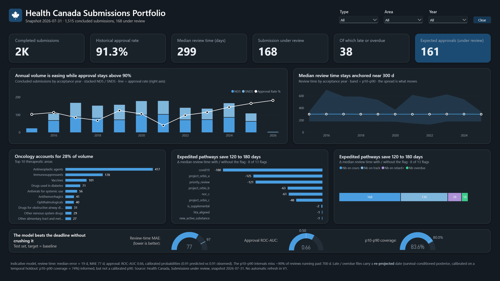
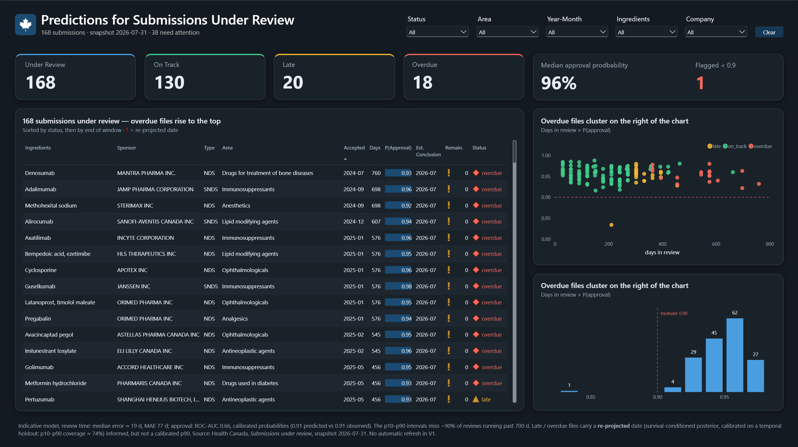
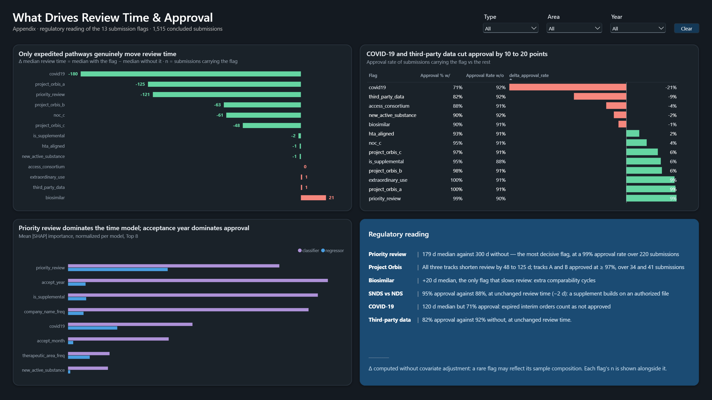

# Regulatory Approval Predictor — Health Canada

> Two XGBoost models over Health Canada drug submissions: how long a submission
> will spend in review, and whether it will be approved — with a SHAP-based
> regulatory reading of the drivers, surfaced in a 3-page Power BI dashboard.


## Overview

- **Data:** [*Drug and health product submissions under review*](https://www.canada.ca/en/health-canada/services/drug-health-product-review-approval/submissions-under-review.html)
  — Health Canada, public, monthly. Snapshot `2026-07-31`, real (not synthetic).
- **Models:** `XGBRegressor` for review time (`review_days`), `XGBClassifier` for
  approval outcome, both explained with SHAP.
- **Dashboard:** Power BI (`.pbip`), 3 pages, fed by the pipeline's CSV exports.

## Dashboard

Power BI report built on the pipeline's outputs — 11 tables, star schema, 42 DAX
measures. Three pages, each answering a different question.

**Portfolio** — how is the program doing? Volume and approval rate by year, review-time
spread (p10–p90), top therapeutic areas, how much expedited pathways save, and the
model-quality gauges at a glance (MAE 77 d, ROC-AUC 0.66, p10–p90 coverage 83.6 %).



**Predictions** — what's in flight right now? All 168 submissions under review, overdue
files sorted to the top, each with an approval probability and an estimated (or
re-projected) conclusion date. The scatter makes the pattern visible at a glance:
overdue files cluster on the right.



**Drivers** — why? SHAP feature importance per model, and the regulatory reading of the
13 submission flags: priority review cuts review time by 121 days, COVID-19 by 180 —
but biosimilars run 21 days *longer*. COVID-19 and third-party-data submissions also
approve 9–21 points less often than the rest, despite the shorter reviews.



## Key insights

- **Expedited pathways work.** Priority review, Project Orbis and COVID-19 flags cut
  review time to ~120–180 days vs ~300 for the rest — and priority review still
  approves at 99%.
- **Biosimilars are the outlier.** The only flag that *slows* review (+21 days),
  reflecting the extra comparability cycles they require.
- **Speed and approval aren't the same axis.** COVID-19 submissions review fastest but
  approve least (71% vs 92%) — expired interim orders count as not approved, not a
  model failure.
- **Supplemental submissions (SNDS) approve more often** than new ones (95% vs 88%) at
  roughly the same review time — they build on an already-authorized file.
- **168 submissions are in flight**, 38 of them late or overdue; late/overdue files get
  a Bayesian re-projected date instead of a stale point estimate (see
  [docs/methodology.md](docs/methodology.md)).

## Model performance — 2026-07 snapshot

| Model | Key metric (test) | Baseline |
|---|---|---|
| Review time | MAE **77 days**, median AE **19 days** | median predictor: MAE 97 |
| Approval | ROC-AUC **0.66**, Brier **0.076**, calibrated (0.911 vs 0.913 observed) | 0.50 / 0.078 |

A discrete-time survival model and a continuous AFT were also explored to handle
censoring — both improve interval coverage but lose median accuracy, so they're kept as
a documented alternative rather than the primary model. Full methodology and the
survival comparison: [docs/methodology.md](docs/methodology.md),
[docs/survival-analysis.md](docs/survival-analysis.md).

## Quick start

```bash
pip install -r requirements.txt

python scripts/build_dataset.py          # raw .xlsx -> cleaned training table
python scripts/train_models.py           # trains both models, writes metrics / SHAP / predictions
python scripts/calibrate_reprojection.py # calibrates the late/overdue re-projection
python scripts/predict_under_review.py   # predictions for the in-flight submissions

pytest                                   # data + pipeline checks
```

Place the source workbook at `data/raw/submissions-under-review-2026-07.xlsx` (already
present), then open `dashboard/powerbi/Health Canada Regulatory Approval Predictor.pbip`
in Power BI Desktop for the dashboard.

## Repo structure

```
├── dashboard/powerbi/   Power BI project (.pbip + .Report + .SemanticModel)
├── data/        raw workbook + processed CSVs
├── src/         pipeline library (data, features, models, SHAP, uncertainty, re-projection)
├── scripts/     CLI entry points (build, train, calibrate, predict)
├── reports/     metrics, SHAP outputs, dashboard screenshots
├── tests/       pytest suite
└── docs/        methodology, data dictionary, survival-analysis writeup
```

`sql/` and `dashboard/tableau/` are unused placeholders from the project template.

## Limitations

- ~1,500 rows is small for gradient boosting — predictions are indicative.
- Coverage bounded by regulatory transparency (NDS 2015+, SNDS 2016+); pre-2018
  rows lack sponsor names.
- Single snapshot, no automated refresh in V1.
- Right-censoring isn't modelled in training, so the p10–p90 band misses ~90% of
  reviews running past 700 days; the re-projection and survival exploration both
  address this without fully solving it.

Full list in [docs/methodology.md](docs/methodology.md).

## License

MIT — see [LICENSE](LICENSE).
